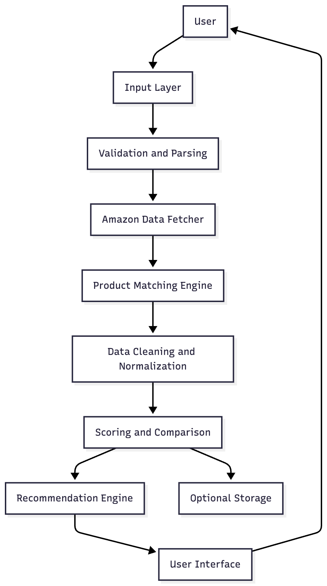
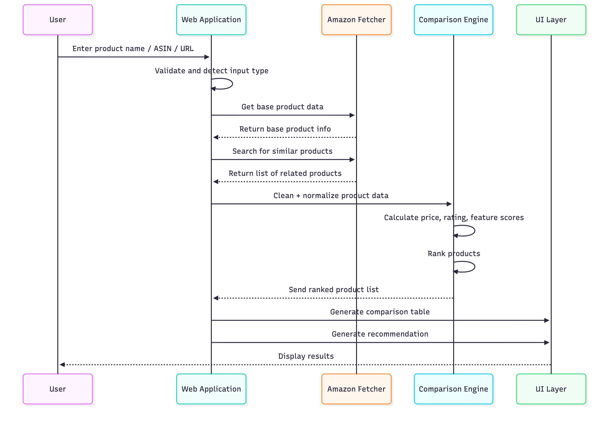

# Amazon Product Comparison & Review Intelligence Platform

## Project Overview

This project is a web-based application that helps users make informed purchasing decisions on Amazon by automatically identifying and comparing similar products.

Instead of manually opening multiple product pages, checking reviews, features, and prices, this platform collects all critical data for the top 5 closest matching products and presents it in a structured comparison with a final recommendation.

The user can provide **any one of the following inputs**:

* Product Name
* ASIN
* Amazon Product URL

Based on that input, the system finds related competing products and provides a side-by-side analysis.

---

## System Architecture Diagram



---

## Process Flow Diagram




## Objectives

The main objectives of this project are:

* Reduce the time spent comparing similar products on Amazon
* Provide a structured breakdown of product features, price, and reviews
* Help users identify the best value-for-money option
* Present a clean, simple and readable user interface
* Practice real-world data extraction and analysis techniques

---

## Key Features

### 1. Input Options

The user can enter:

* Product name (e.g. "Sony WH-1000XM5")
* ASIN (e.g. "B09XS7JWHH")
* Product URL (full Amazon product link)

### 2. Related Product Detection

The system identifies at least **5 closely related products** using:

* Search results
* Similar product sections
* Keyword-based matching

### 3. Data Extraction

The application collects the following information:

* Product name
* Brand
* Current price
* Rating (out of 5)
* Total number of reviews
* Key features / bullet points
* Available variants (if any)

### 4. Comparison Table

All products are displayed in a structured tabular format for easy comparison.

### 5. Pros & Cons (Optional)

If implemented, short pros and cons are shown based on available information.

### 6. Final Recommendation

The system provides a text-based conclusion explaining:

* Which product offers the best overall value
* Why it is recommended
* Key deciding factors (price, rating, features)

### 7. Error Handling

The application handles:

* Invalid URLs
* Incorrect ASINs
* Empty searches
* Network/timeout errors

---

## Architecture

High-level system flow:

```
User Input (Name / ASIN / URL)
              |
              v
     Input Processing Module
              |
              v
     Amazon Data Fetch Module
       (API or Web Scraping)
              |
              v
  Similar Product Identification
              |
              v
      Data Cleaning & Normalization
              |
              v
       Comparison & Scoring Engine
              |
              v
      Recommendation Generator
              |
              v
           User Interface
```

---

## Tech Stack

The following tools and libraries are recommended (not mandatory):

### Backend

* Python
* Requests / Selenium / Playwright / BeautifulSoup

### Data Processing

* Pandas
* NumPy

### Frontend (Choose One)

* Streamlit
* Flask + HTML/CSS
* FastAPI + HTML
* React (optional)

### Database (Optional)

* SQLite / PostgreSQL / CSV

### Visualization (Optional)

* Matplotlib / Plotly

---

## Folder Structure

A suggested project structure:

```
amazon-comparison-project/
├── app/
│   ├── main.py
│   ├── scraper.py
│   ├── comparator.py
│   ├── recommender.py
│   └── utils.py
├── frontend/
│   ├── templates/
│   └── static/
├── data/
│   └── sample_output.csv
├── images/
│   └── screenshots/
├── requirements.txt
└── README.md
```

---

## Setup Instructions

### 1. Clone the repository

```bash
git clone <your-repo-url>
cd amazon-comparison-project
```

### 2. Create virtual environment

```bash
python -m venv venv
source venv/bin/activate     # Mac/Linux
venv\Scripts\activate        # Windows
```

### 3. Install dependencies

```bash
pip install -r requirements.txt
```

### 4. Run the application

**For Streamlit:**

```bash
streamlit run app/main.py
```

**For Flask/FastAPI:**

```bash
python app/main.py
```

Then open your browser and go to:

```
http://localhost:8501   (Streamlit)
http://localhost:5000   (Flask)
http://localhost:8000   (FastAPI)
```

---

## Input Examples

✅ Product Name:

```
Sony WH-1000XM5
```

✅ ASIN:

```
B09XS7JWHH
```

✅ Product URL:

```
https://www.amazon.in/dp/B09XS7JWHH
```

---

## Output Examples

The system should display:

| Product Name | Price   | Rating | Reviews | Key Feature        |
| ------------ | ------- | ------ | ------- | ------------------ |
| Product A    | ₹29,999 | 4.5    | 12,340  | Noise cancellation |
| Product B    | ₹25,499 | 4.4    | 10,120  | Long battery life  |
| Product C    | ₹31,200 | 4.6    | 8,421   | Wireless charging  |
| Product D    | ₹28,100 | 4.3    | 9,310   | Bass boost         |
| Product E    | ₹34,499 | 4.7    | 14,672  | Premium design     |

**Final Recommendation Example:**

```
Based on pricing, user ratings and overall feature balance,
Product B offers the best value for money. It provides excellent
performance at a comparatively lower cost and has strong customer feedback.
```

---

## Mandatory Requirements Checklist

To pass the project, the following must be completed:

* Accept product name, ASIN or URL as input
* Fetch minimum 5 similar products
* Display at least 5 comparison factors
* Show comparison in table format
* Provide one final recommendation
* Clean UI and readable output
* Proper error handling
* Well-organized code structure

---

## Bonus Criteria (For Top Scores)

Implement any of the following to stand out:

* Price history tracking
* Review sentiment summary
* Similarity score calculation
* Graphs and charts
* Export to CSV or PDF
* Filters by budget and rating
* Browser extension
* User login & history

---

## Evaluation Criteria

| Area                        | Percentage |
| --------------------------- | ---------- |
| Functionality               | 40%        |
| Code structure & clarity    | 20%        |
| UI / UX                     | 15%        |
| Error handling              | 10%        |
| Innovation / Bonus features | 15%        |

---

## Submission Guidelines

Each participant must submit:

1. GitHub repository link
2. README.md (updated and complete)
3. Screenshots or demo video
4. Short document explaining:

   * Approach used
   * Challenges faced
   * Possible improvements

---

## Final Notes

* Use real-world best practices
* Write clean, readable and modular code
* Add comments where needed
* Focus on clarity, not just features

This project is designed to test real problem-solving ability — not just coding knowledge.

Good luck.
